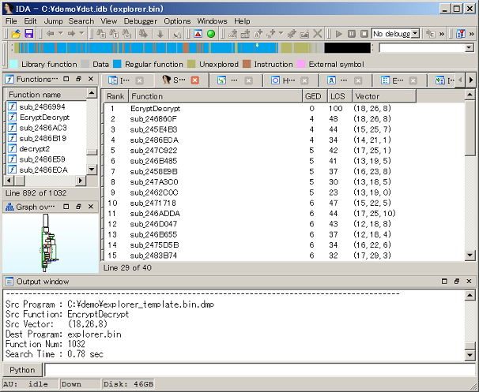

# bingrep
IDA plugin for function search
====

## Description

BinGrep is an IDA plugin which makes it possible to search function in a .idb file
specifying a function in another .idb file. 

This is inspired by binary comparison tools such as BinDiff and others. 
These comparison tools are for patch analysis and try to match all functions 
between two binary, but these can show only one function per each function. 
This plugin is created for malware analysis and can show multiple candidates 
against one function.

## Screenshot

 

## Requirement

IDA Pro 6.x
Python 2.7

## Install

Uncompress and copy to any folder.

## Usage

Suppose that function "func" is in "src.idb" and you want to search corresponding
function in "dst.idb".

1. Dump the functions data of a program which can be a search key.

   Open "src.idb" and run script
    - "File" -> "Script file" (Alt-F7)
    - Run "bingrep_dump.py"

2. Dump the functions data of a program that you want to search.

   Open "dst.idb" and run script
    - "File" -> "Script file" (Alt-F7)
    - Run "bingrep_dump.py"

3. Search the function

   Open "dst.idb" and run script
    - "File" -> "Script file" (Alt-F7)
    - Run "bingrep_search.py"

4. The output will be shown in new tab.

## Licence

The 3-Clause BSD License

## Author

Copyright 2017, Hiroki Hada
All rights reserved.
